# Integration of K8s, GitHub, and Jenkins
## (jobs building on containers == Dynamic Agents).
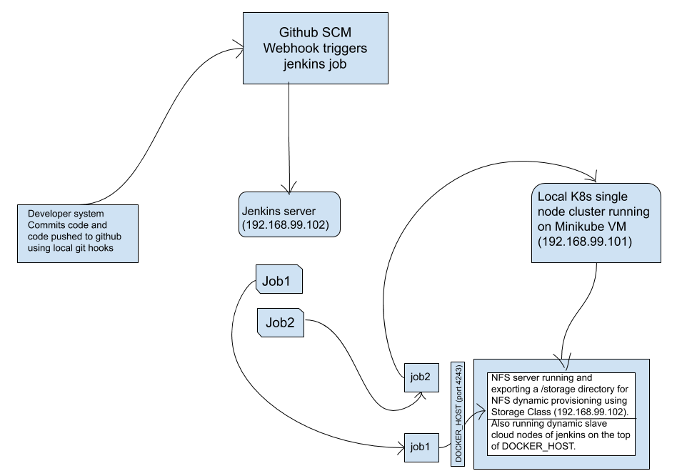

## Tasks to be created:-
1. Create container image that has linux distribution and other basic configuration required to run a cloud node agent for Jenkins.
(e.g. Here we require kubectl to be configured inside that node.)
2. When we launch the job it should automatically starts job on cloud node agent based on the labels provided for dynamic approach to run the jobs.
3. Create a job chain of job1 & job2 using build pipeline plugin in Jenkins.
4. Job1 :- Pull  the Github repo automatically when some developers push repo to Github(using local hooks and web-hooks) and perform the following operations as:
  1. Create the new image dynamically for the application and copy the application code into that corresponding docker image
  2. Push that image to the docker hub (Public repository)  or any private repo (registry).
     (Github code contain the application code and Dockerfile to create a new image)
5. Job2 :- (Should be run on the dynamic agent of Jenkins configured with K8s kubectl command): Launch the application on the top of K8s cluster performing following operations:
  1. If launching first time then create a deployment of the pod using the image created in the previous job else if deployment already exists then do rollout of the existing pod making zero downtime  for the user.
  2. If Application created first time, then expose the application else don’t expose it.

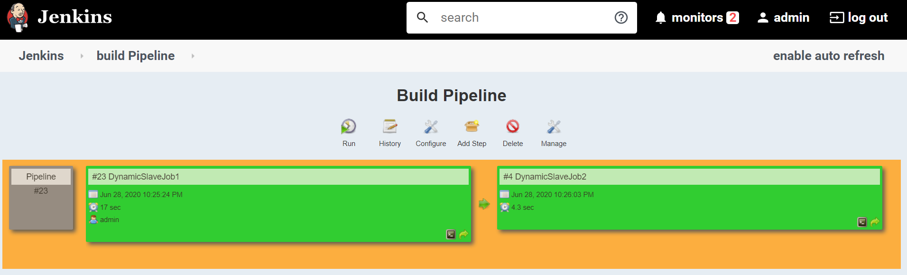
## Prerequisites:- 
A pre-installed K8s cluster(e.g. minikube). In minikube by default, there is no internal NFS dynamic provisioner is available for the storage class so it can claim a PVC or PV dynamically. so we are creating a NFS-client dynamic provisioner in the K8s cluster using a service account, cluster roles, etc., which basically uses RBAC (role-based access controls) Authorization.
###### [follow this repo](https://medium.com/@A4ANK/integration-of-kubernetes-using-nfs-server-3rd-party-nfs-client-dynamic-provisioning-with-298e33c89fbe?source=friends_link&sk=0eca13840760743de585cff57248609b) for creating NFS-client dynamic provisioner in the K8s cluster using a service account, cluster roles, etc.

https://kubernetes.io/docs/tasks/configure-pod-container/configure-service-account/

https://kubernetes.io/docs/reference/access-authn-authz/rbac/

Also, install Github, Build Pipeline Plugin in Jenkins.

For creating cloud nodes using Docker(install Docker plugin in Jenkins)
then create a DOCKER_HOST (install docker, start and enable it's services). 
```
[root@server ~]# systemctl enable --now docker
[root@server ~]# systemctl status docker

[root@server ~]# vi /usr/lib/systemd/system/docker.service
```
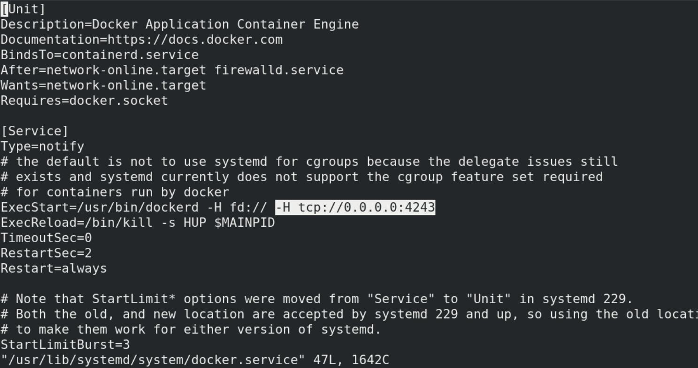
```
[root@server ~]# systemctl daemon-reload 
[root@server ~]# ss -tnlp | grep 4243
LISTEN   0         128                       *:4243                   *:*        users:(("dockerd",pid=7333,fd=3))   
```
## Manage Jenkins -> Manage Nodes and Clouds
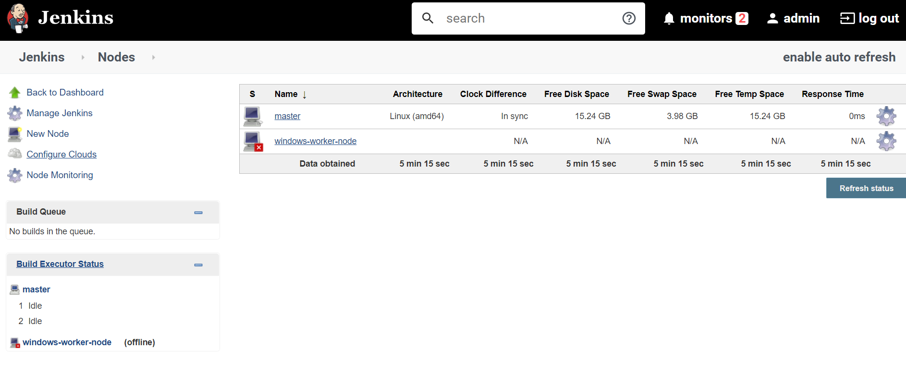

###### Configure Clouds
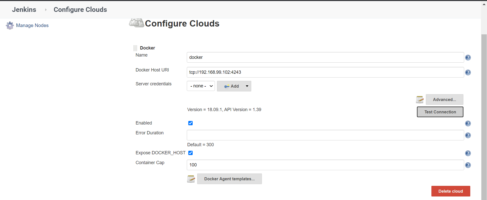
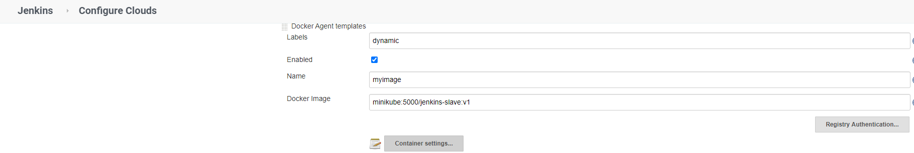
###### Container Settings
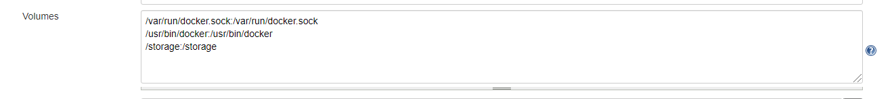
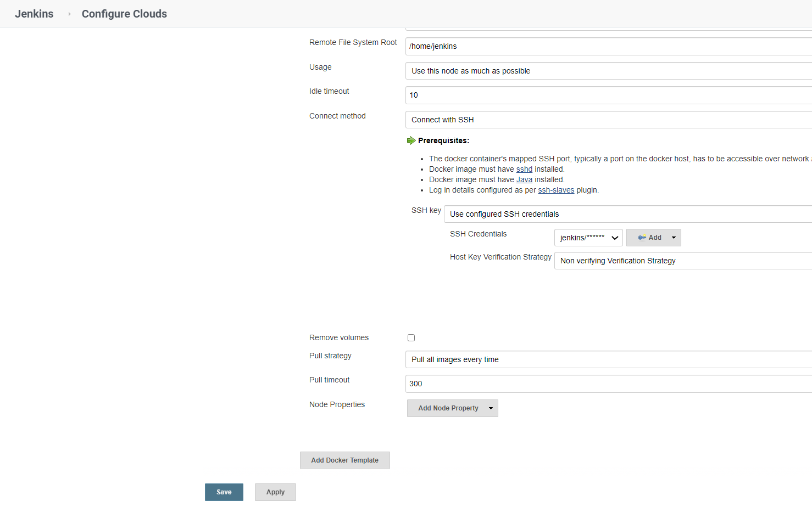

# Job1
###### Pull the Github repo automatically when some developers push repo to Github(using local hooks and web-hooks) and perform the following operations as:
  1. Create the new image dynamically for the application and copy the application code into that corresponding docker image
  2. Push that image to the docker hub (Public repository) or any private repo (registry). (Github code contain the application code and Dockerfile to create a new image)
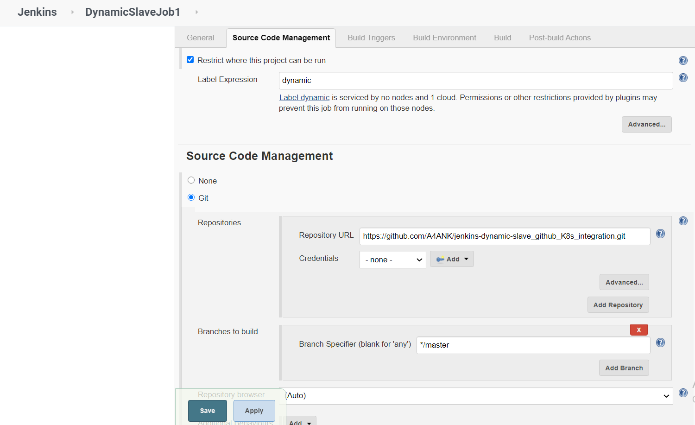

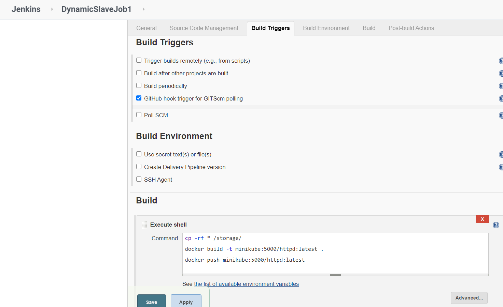

# Job2
###### (Should be run on the dynamic agent of Jenkins configured with K8s kubectl command): Launch the application on the top of K8s cluster performing following operations:
  1. If launching first time then create a deployment of the pod using the image created in the previous job. Else if deployment already exists then do rollout of the existing pod making zero downtime for the user.
  2. If Application created first time, then Expose the application. Else don't expose it.
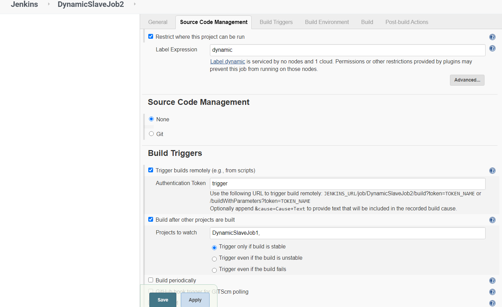

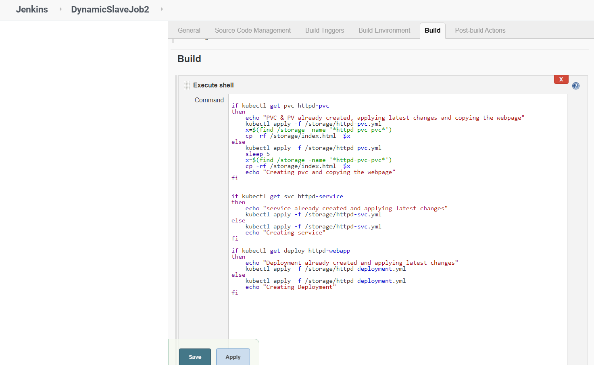

P.S.- Any questions or suggestions are welcome.
All the scripts and configuration files are present in this GitHub repo.
